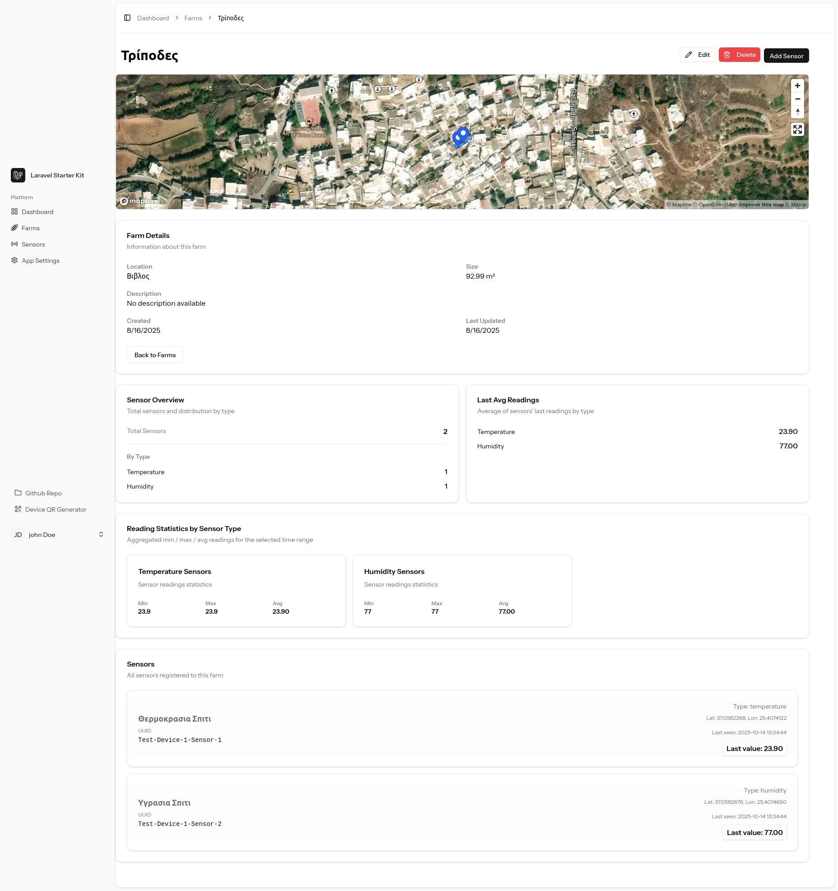
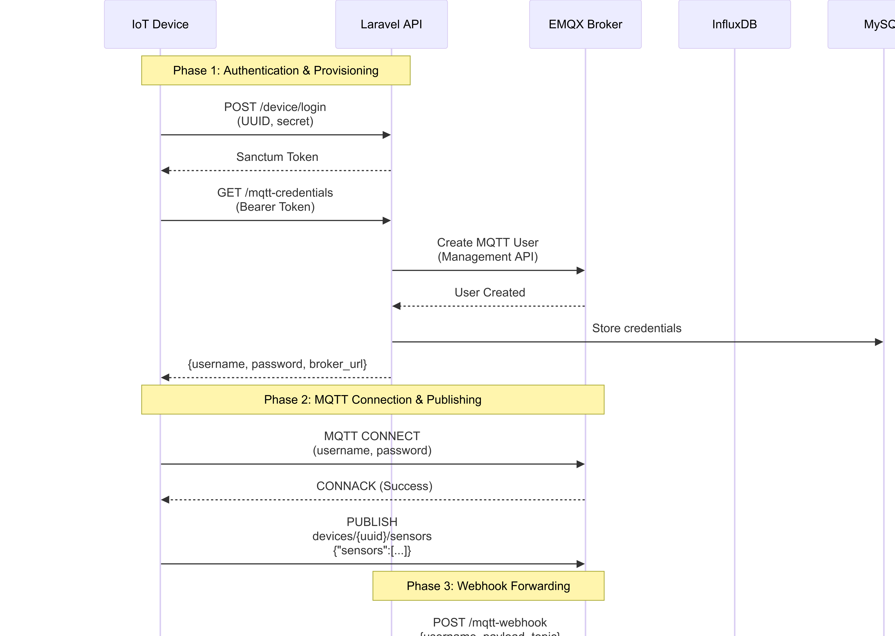
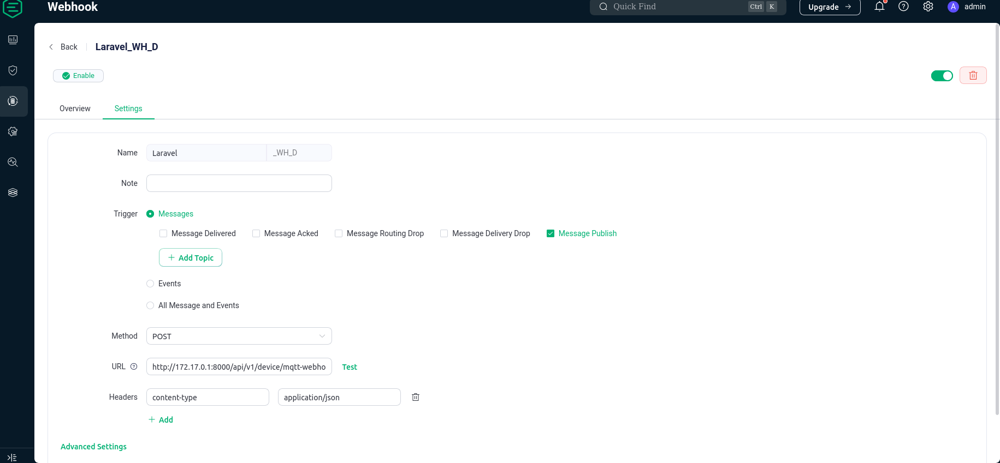

# Αναφορά 2

**Φοιτητής:** Καλογείτονας Γεωργιος

**Επιβλέπων Καθηγητής:** Νικόλαος Σκλάβος

**Ημερομηνία:** Οκτώβριος 2025

---

## Περίληψη


Η παρούσα αναφορά είναι οργανωμένη σε τρία διακριτά κεφάλαια  τα οποία περιγράφουν διαφορετικές φάσεις της υλοποίησης:

1. Εμπλουτισμός Σελίδα Αγρού — η τρέχουσα ενότητα: παρουσίαση της σελίδας λεπτομερειών αγρού με μετρικές και στατιστικά.
2. Real‑time Communication — υλοποίηση real‑time ενημερώσεων μέσω WebSockets (Laravel Reverb + Echo).
3. MQTT Integration — υποστήριξη επικοινωνίας των συσκευών μέσω MQTT.


# Εμπλουτισμός Σελίδα Αγρού (Metrics)

Η ενότητα που ακολουθεί περιγράφει τις προσθήκες στις μετρικές του "Farm Show": τις κάρτες συνοπτικών στατιστικών, την ενσωμάτωση των τελευταίων αναγνώσεων αισθητήρων και την οπτικοποίηση σε χάρτη.

## Στόχοι του μέρους αυτού

- Να εμφανιστεί στο χρήστη μια ενοποιημένη εικόνα του αγρού με γεωγραφικά δεδομένα (χάρτης) και συνοπτικές μετρικές.
- Να εμφανίζονται συνοπτικά στατιστικά ανά τύπο αισθητήρα (min, max, avg) και συνολικός αριθμός αισθητήρων.
- Να παρουσιάζεται η τελευταία μετρούμενη τιμή κάθε αισθητήρα για γρήγορη επισκόπηση.
- Να υποστηρίζεται real‑time ενημέρωση της σελίδας όταν εισέρχονται νέες μετρήσεις.

## Σύντομη Περιγραφή Υλοποίησης

Η σελίδα `Farm Show` συγκεντρώνει δεδομένα από δύο πηγές:

- Τη σχεσιακή βάση (Eloquent models: `Farm`, `Sensor`, `Device`) για μεταδεδομένα και την τελευταία εγγεγραμμένη τιμή (`last_reading`, `last_reading_at`).
- Την υπηρεσία χρονοσειρών (InfluxDB) για ιστορικά δεδομένα και στατιστικά μέσω της κλάσης `SensorTimeSeriesService`.

Η ροή παρουσίασης είναι η εξής:

1. Ο controller της σελίδας φορτώνει το `Farm` με τα σχετιζόμενα `sensors` (με tenant scope).
2. Για κάθε τύπο αισθητήρα καλείται η υπηρεσία χρονικών σειρών για να υπολογίσει στατιστικά (min/max/avg) σε προκαθορισμένο χρονικό εύρος.
3. Οι συνοπτικές κάρτες στατιστικών εμφανίζονται στην κορυφή της σελίδας, ακολουθούμενες από τον χάρτη και τη λίστα αισθητήρων με την τελευταία τιμή.

### Οπτικοποίηση

Η σελίδα περιλαμβάνει έναν χάρτη  που δείχνει τη θέση του αγρού και των αισθητήρων όταν υπάρχουν γεωγραφικές συντεταγμένες.



## Στατιστικά / Metrics — Τεχνικές λεπτομέρειες

Τα στατιστικά που εμφανίζονται στη σελίδα έχουν τις εξής ιδιότητες και πηγές:

- Aggregations: min, max, avg, count — υπολογίζονται στην InfluxDB μέσω Flux queries στην `SensorTimeSeriesService`.
- Εύρος δεδομένων: προεπιλεγμένα `-24h` για 24ωρα στατιστικά, με fallback σε `-7d` ή `-30d` αν δεν υπάρχουν δεδομένα (progressive range widening).
- Tagging: κάθε σημείο αποθηκεύεται στην InfluxDB με tags `user_id`, `farm_id`, `sensor_id`, `sensor_type` ώστε να επιτρέπεται γρήγορη ομαδοποίηση και φιλτράρισμα ανά αγρό.
- Local cache: για υψηλή απόδοση η εφαρμογή αποθηκεύει τη "τελευταία" μέτρηση σε πεδία του μοντέλου `Sensor` (`last_reading`, `last_reading_at`) έτσι ώστε η λίστα αισθητήρων να εμφανίζεται γρήγορα χωρίς κάθε φορά κλήση προς την InfluxDB.

Σημειώσεις υλοποίησης:

- Η `SensorTimeSeriesService::stats(int $sensorId, string $range)` επιστρέφει normalized τιμές και χειρίζεται σενάρια μη διαθεσιμότητας δεδομένων.
- Τα queries στη Flux κατασκευάζονται έτσι ώστε να εκτελούν aggregation σε επίπεδο `sensor_type` όταν απαιτείται σύνοψη ανά τύπο αισθητήρα.

### Βελτίωση απόδοσης — Deferred loading (Inertia::defer)

Για να βελτιώσουμε τον χρόνο φόρτωσης της σελίδας `Farm Show`, τα βαρύτερα ερωτήματα χρονοσειρών εκτελούνται με deferred loading. Στον controller χρησιμοποιούμε το `Inertia::defer()` ώστε η αρχική απόδοση της σελίδας να γίνεται γρήγορα με τα δεδομένα της σχεσιακής βάσης (Eloquent), ενώ οι συγκεντρωτικές μετρικές από την InfluxDB φορτώνονται ασύγχρονα και ενημερώνουν τις κάρτες/γραφικά όταν είναι διαθέσιμες.

Οφέλη:

- Μικρότερος χρόνος initial render και ταχύτερο perceived performance για τον χρήστη.
- Δυνατότητα retry / polling σε περίπτωση αποτυχίας του time‑series query.
- Διευκόλυνση caching στα aggregates για συχνά χρησιμοποιούμενα εύρη.

Παράδειγμα (εισαγωγή στην αναφορά):

```php
return Inertia::render('Farms/Show', [
  'farm' => $farm,
  'sensors' => $sensors,
  'sensorDbStats' => $sensorDbStats,
  'timeSeriesStats' => Inertia::defer(fn () => $ts->farmStats($farm, '-24h')),
]);
```


## Real‑time ενημερώσεις

Η σελίδα υποστηρίζει real‑time ενημέρωση των καρτών "Latest Reading" μέσω broadcasting:

- Το backend εκπέμπει `SensorReadingEvent` όταν μια νέα μέτρηση γράφεται και το `Sensor` ενημερώνεται (`last_reading`, `last_reading_at`).
- Ο frontend εγγράφεται στο ιδιωτικό κανάλι `sensor.{sensorId}` και ενημερώνει το UI αμέσως μόλις φτάσει το event.

Αυτό επιτρέπει στους χρήστες να βλέπουν νέες μετρήσεις στον πίνακα και στις κάρτες χωρίς refresh.


## Σχετικά αρχεία

Κάποια από τα κύρια αρχεία και components που σχετίζονται με την ενότητα "Enhanced Farm Page" είναι:

- [`app/Models/Farm.php`](https://github.com/gkalogeitonas/agronos/blob/main/app/Models/Farm.php) — Eloquent model του αγρού και σχέσεις με `sensors`.
- [`app/Models/Sensor.php`](https://github.com/gkalogeitonas/agronos/blob/main/app/Models/Sensor.php) — μοντέλο αισθητήρα, πεδία `last_reading` και `last_reading_at`.
- [`app/Http/Controllers/SensorController.php`](https://github.com/gkalogeitonas/agronos/blob/main/app/Http/Controllers/SensorController.php) και [`app/Http/Controllers/FarmController.php`](https://github.com/gkalogeitonas/agronos/blob/main/app/Http/Controllers/FarmController.php) — controllers για φόρτωση δεδομένων και rendering της σελίδας.
- [`app/Services/TimeSeries/SensorTimeSeriesService.php`](https://github.com/gkalogeitonas/agronos/blob/main/app/Services/TimeSeries/SensorTimeSeriesService.php) — service για ερωτήματα και aggregation προς την InfluxDB.
- [`resources/js/pages/Sensors/Show.vue`](https://github.com/gkalogeitonas/agronos/blob/main/resources/js/pages/Sensors/Show.vue) και [`resources/js/pages/Farms/Show.vue`](https://github.com/gkalogeitonas/agronos/blob/main/resources/js/pages/Farms/Show.vue) — frontend pages που εμφανίζουν τις κάρτες, τον χάρτη και τη λίστα αισθητήρων.

## Επόμενα βήματα

- Προσθήκη φίλτρου εύρους μετρήσεων στο UI: επιλογές `24h`, `7d`, `30d` και custom range (ημερομηνίες/ώρες). Το φίλτρο θα επιτρέπει στον χρήστη να επιλέγει ποιες μετρήσεις θέλει να δει και θα ενημερώνει δυναμικά τις κάρτες στατιστικών, τον πίνακα ιστορικών και τα γραφήματα.
- Backend υποστήριξη: αποστολή του επιλεγμένου εύρους ως query parameter προς τις μεθόδους της `SensorTimeSeriesService` (`recentReadings`, `stats`), με υποστήριξη limit/paging και caching για συχνά χρησιμοποιούμενα εύρη.


---


# Real‑time Communication

Η ενότητα αυτή περιγράφει την υλοποίηση του real‑time layer της πλατφόρμας, η οποία επιτυγχάνεται με WebSockets χρησιμοποιώντας Laravel Reverb (server side) και Laravel Echo (client side). Στόχος είναι η άμεση διάδοση νέων μετρήσεων και γεγονότων στον browser χωρίς να απαιτείται polling.

Αρχιτεκτονική & ροή δεδομένων

- Εγγραφή μιας νέας μέτρησης → εγγραφή στην InfluxDB (και update των πεδίων `Sensor::last_reading` στο σχεσιακό μοντέλο) → εκπομπή event `SensorReadingEvent` από το service `SensorDataService`.
```php
    event(new SensorReadingEvent(
        $sensorModel->id,
        [
            'value' => $sensorModel->last_reading,
            'time' => optional($sensorModel->last_reading_at)->toDateTimeString() ?: (string) $sensorModel->last_reading_at ?: now()->toDateTimeString(),
        ]
    ));
```
            
- Το event υλοποιεί `ShouldBroadcast` και μεταδίδεται σε ιδιωτικά κανάλια `sensor.{sensorId}`. Προς το παρόν τα events εκπέμπονται σε επίπεδο αισθητήρα και όχι σε επίπεδο αγρού.

```php

class SensorReadingEvent implements ShouldBroadcast
{
    use Dispatchable, InteractsWithSockets, SerializesModels;

    public function __construct(public int $sensorId, public array $payload = [])
    {
    }

    public function broadcastOn(): PrivateChannel
    {
        return new PrivateChannel("sensor.{$this->sensorId}");
    }

    public function broadcastWith(): array
    {
        return $this->payload;
    }
}
```

- Ο frontend με Laravel Echo εγγράφεται στα αντίστοιχα private κανάλια· οι  listeners  είναι  η σελίδα του αισθητηρα  `resources/js/pages/Sensors/Show.vue` αλλα και το component του αισθητηρα `resources/js/components/SensorCard.vue`, τα οποία ενημερώνουν το UI (latest reading, recent readings) σε πραγματικό χρόνο.


Client implementation (συνοπτικά)

- Εγκαθιστούμε και ρυθμίζουμε το Echo ώστε να συνδεθεί στο Reverb websocket endpoint.
- Οι κύριες subscriptions γίνονται σε επίπεδο αισθητήρα, π.χ. από το component `SensorCard.vue` και από τη σελίδα `Sensors/Show.vue`:


Ασφάλεια & fallback

- Τα ιδιωτικά κανάλια απαιτούν authorization — οι έλεγχοι γράφονται σε `routes/channels.php` και βασίζονται στο policy του `Farm/Sensor`.


Channels — authorization για κανάλια αισθητήρων

Στο αρχείο `routes/channels.php` υλοποιείται ο έλεγχος πρόσβασης για τα ιδιωτικά κανάλια των αισθητήρων. Συγκεκριμένα, ο server ελέγχει αν ο αιτών χρήστης είναι ο ιδιοκτήτης του αισθητήρα ή αν πληροί τους όρους tenancy/μέλους του αγρού. Το σημεία κλειδί από το repository είναι διαθέσιμο στο GitHub:

- [`routes/channels.php`](https://github.com/gkalogeitonas/agronos/blob/main/routes/channels.php)

Ενδεικτικό απόσπασμα (απλοποιημένο):

```php
Broadcast::channel('sensor.{sensorId}', function ($user, $sensorId) {
  $sensor = Sensor::find($sensorId);
  if (! $sensor) return false;

  // Allow if the authenticated user is the owner of the sensor
  if ($sensor->user_id && (int) $sensor->user_id === (int) $user->id) {
    return true;
  }

  // Fallback: extend with tenant / farm membership checks if needed
  return false;
});
```

Αυτό σημαίνει ότι μόνο εξουσιοδοτημένοι χρήστες βλέπουν τα δεδομένα του συγκεκριμένου αισθητήρα μέσω του WebSocket καναλιού — ένα σημαντικό κομμάτι της ασφάλειας του real‑time layer.


Κύρια components / αρχεία

- [`app/Events/SensorReadingEvent.php`](https://github.com/gkalogeitonas/agronos/blob/main/app/Events/SensorReadingEvent.php) — payload με `sensor_id`, `farm_id`, `value`, `unit`, `timestamp`.
- [`app/Services/SensorDataService.php`](https://github.com/gkalogeitonas/agronos/blob/main/app/Services/SensorDataService.php) — επεξεργασία εισερχόμενων payloads, ενημέρωση `Sensor` μοντέλου, dispatch job για InfluxDB και εκπομπή `SensorReadingEvent`.
- [`routes/channels.php`](https://github.com/gkalogeitonas/agronos/blob/main/routes/channels.php) — policy checks για ιδιωτικά κανάλια (εξουσιοδότηση χρήστη για πρόσβαση σε `sensor.{id}` / `farm.{id}`).
- [`resources/js/bootstrap/echo.ts`](https://github.com/gkalogeitonas/agronos/blob/main/resources/js/bootstrap/echo.ts) — αρχικοποίηση του Echo client (authToken, broadcaster, host).
- [`resources/js/pages/Sensors/Show.vue`](https://github.com/gkalogeitonas/agronos/blob/main/resources/js/pages/Sensors/Show.vue) — σελίδα αισθητήρα (listener που ενημερώνεται σε πραγματικό χρόνο).
- [`resources/js/components/SensorCard.vue`](https://github.com/gkalogeitonas/agronos/blob/main/resources/js/components/SensorCard.vue) — component που εγγράφεται σε per‑sensor κανάλι και εμφανίζει live την τελευταία τιμή.
- [`config/broadcasting.php`](https://github.com/gkalogeitonas/agronos/blob/main/config/broadcasting.php) — ρύθμιση driver (reverb/pusher compatible) και connection settings.


#  MQTT Integration — υποστήριξη επικοινωνίας των συσκευών μέσω MQTT

Η ενότητα αυτή περιγράφει την ενσωμάτωση του πρωτοκόλλου MQTT στην πλατφόρμα για την υποστήριξη επικοινωνίας IoT συσκευών. Το MQTT (Message Queuing Telemetry Transport) είναι ένα ελαφρύ πρωτόκολλο pub/sub που είναι ιδανικό για συσκευές με περιορισμένους πόρους και χαμηλό bandwidth, καθιστώντας το την κατάλληλη επιλογή για γεωργικές IoT εφαρμογές.

## Στόχοι της υλοποίησης

- Παροχή εναλλακτικού τρόπου επικοινωνίας για συσκευές με χαμηλή κατανάλωση ενέργειας
- Ασφαλής διαχείριση credentials και authorization ανά συσκευή
- Διατήρηση συμβατότητας με το υπάρχον HTTP API
- Αυτόματη προώθηση (forwarding) δεδομένων από το MQTT broker στο Laravel backend
- Υποστήριξη real-time ενημερώσεων μέσω της ίδιας υποδομής WebSocket

## Αρχιτεκτονική MQTT Layer

### Επιλογή EMQX Broker

Για τον MQTT broker επιλέχθηκε το EMQX, ένα open-source, υψηλής απόδοσης MQTT broker που παρέχει:

- Built-in authentication και authorization μηχανισμούς
- REST API (Management API v5) για προγραμματιστικό έλεγχο
- Webhooks για integration με εξωτερικά συστήματα
- Dashboard για monitoring και διαχείριση

Το EMQX εκτελείται ως Docker container και ενσωματώνεται στο `docker-compose.yml` του project:

```yaml
emqx:
  image: emqx/emqx:latest
  ports:
    - "1883:1883"   # MQTT
    - "8083:8083"   # MQTT over WebSocket
    - "18083:18083" # Management Dashboard
  volumes:
    - ./docker/emqx/acl.conf:/opt/emqx/etc/acl.conf
```

### Ροή επικοινωνίας

Η πλήρης ροή επικοινωνίας μιας IoT συσκευής μέσω MQTT είναι η εξής:

1. **Device provisioning**: Η συσκευή πραγματοποιεί HTTP login με UUID/secret και λαμβάνει Sanctum token
2. **MQTT credential provisioning**: Με το token καλεί το endpoint `/api/v1/device/mqtt-credentials` και λαμβάνει MQTT username/password
3. **MQTT connection**: Η συσκευή συνδέεται στον EMQX broker με τα credentials
4. **Data publishing**: Η συσκευή κάνει publish δεδομένα στο topic `devices/{uuid}/sensors`
5. **Webhook forwarding**: Το EMQX προωθεί το message στο Laravel endpoint `/api/v1/device/mqtt-webhook`
6. **Data processing**: Το Laravel επεξεργάζεται τα δεδομένα όπως και στο HTTP endpoint
7. **Storage & broadcast**: Αποθήκευση στην InfluxDB και εκπομπή WebSocket event για real-time updates




*Διάγραμμα: Ροή επικοινωνίας MQTT — Device → EMQX → Laravel → InfluxDB / WebSocket.*

## EMQX Service — Διαχείριση Χρηστών και Authorization

Για την αλληλεπίδραση με το EMQX Management API δημιουργήθηκε η κλάση `EmqxService` που παρέχει μεθόδους για τη διαχείριση MQTT users και authorization rules.

### Αρχείο: `app/Services/EmqxService.php`

Η κλάση χρησιμοποιεί το Laravel HTTP client για επικοινωνία με το EMQX REST API:

```php
class EmqxService
{
    protected string $baseUrl;
    protected string $basePath;
    protected string $authId;
    protected $http;

    public function __construct()
    {
        $this->baseUrl = rtrim(config('services.emqx.url'), '/');
        $this->basePath = trim(config('services.emqx.base_path'), '/');
        $this->authId = config('services.emqx.authenticator_id');

        $this->http = Http::withBasicAuth(
            config('services.emqx.api_key'),
            config('services.emqx.secret_key')
        )->acceptJson();
    }
}
```

### Βασικές λειτουργίες

**createUser()** — Δημιουργία MQTT user στο built-in database του EMQX:

```php
public function createUser(string $username, string $password): mixed
{
    $url = $this->apiUrl("authentication/{$this->authId}/users");
    
    $payload = [
        'user_id' => $username,
        'password' => $password,
    ];

    $response = $this->http->post($url, $payload);
    
    if ($response->successful()) {
        return $response->json();
    }
    
    // Error handling...
}
```

**authorizeUser()** — Ορισμός ACL rules για έναν χρήστη:

```php
public function authorizeUser(string $username, ?array $rules = null)
{
    $url = $this->apiUrl("authorization/sources/built_in_database/rules/users");
    
    $payload = [
        [
            'rules' => $rules,
            'username' => $username,
        ],
    ];

    $response = $this->http->post($url, $payload);
    return $response->successful();
}
```

**deleteUser()** — Διαγραφή MQTT user:

```php
public function deleteUser(string $username): bool
{
    $url = $this->apiUrl("authentication/{$this->authId}/users/" 
        . rawurlencode($username));
    
    $response = $this->http->delete($url);
    return $response->successful();
}
```

### Authentication και Authorization

Το EMQX υποστηρίζει authentication μέσω του built-in database authenticator. Κάθε συσκευή λαμβάνει μοναδικά credentials (username/password) που αποθηκεύονται τόσο στο EMQX όσο και στη MySQL βάση του Laravel.

Για authorization χρησιμοποιούνται ACL (Access Control List) rules που ορίζουν ποια topics μπορεί να χρησιμοποιήσει κάθε client. Οι default rules βρίσκονται στο αρχείο `docker/emqx/acl.conf`:

```erlang
%% Allow devices to publish only to channels under their username
{allow, all, publish, ["devices/${username}/#"]}.

%% Allow devices to subscribe to their own channels
{allow, all, subscribe, ["devices/${username}/#"]}.

%% Deny everything else
{deny, all}.
```

Αυτό σημαίνει ότι μια συσκευή με username `device-abc-123` μπορεί να κάνει publish/subscribe **μόνο** σε topics που ξεκινούν με `devices/device-abc-123/`, εξασφαλίζοντας πλήρη απομόνωση μεταξύ συσκευών.

## MQTT Credential Provisioning

Για την αυτοματοποιημένη παροχή MQTT credentials στις συσκευές δημιουργήθηκε το `MqttCredentialService` και το αντίστοιχο HTTP endpoint.

### Αρχείο: `app/Services/MqttCredentialService.php`

```php
class MqttCredentialService
{
    public function createCredentials(Device $device): array
    {
        // Check if credentials already exist
        if ($device->mqtt_username && $device->mqtt_password) {
            return [
                'mqtt_broker_url' => config('services.emqx.url'),
                'username' => $device->mqtt_username,
                'password' => $device->mqtt_password,
                'created' => false,
            ];
        }

        // Generate new credentials
        $username = $device->uuid;
        $password = bin2hex(random_bytes(16));

        // Create user in EMQX
        $emqx = new EmqxService();
        $emqx->createUser($username, $password);

        // Store in database
        $device->update([
            'mqtt_username' => $username,
            'mqtt_password' => $password,
        ]);

        return [
            'mqtt_broker_url' => config('services.emqx.url'),
            'username' => $username,
            'password' => $password,
            'created' => true,
        ];
    }
}
```

### Database Schema

Για την αποθήκευση των MQTT credentials προστέθηκαν δύο νέα πεδία στον πίνακα `devices`:

```php
// Migration: 2025_10_11_000001_add_mqtt_credentials_to_devices_table.php
Schema::table('devices', function (Blueprint $table) {
    $table->string('mqtt_username')->nullable()->unique();
    $table->string('mqtt_password')->nullable();
});
```

### HTTP Endpoint

**Route**: `GET /api/v1/device/mqtt-credentials`

**Authentication**: Απαιτείται Sanctum token (η συσκευή πρέπει να έχει κάνει login)

**Controller**: `DeviceAuthController::mqttCredentials()`

```php
public function mqttCredentials(Request $request, MqttCredentialService $service)
{
    $device = $request->user();
    $credentials = $service->createCredentials($device);
    
    return response()->json($credentials);
}
```

**Response Example**:

```json
{
  "mqtt_broker_url": "mqtt://emqx:1883",
  "username": "550e8400-e29b-41d4-a716-446655440000",
  "password": "a1b2c3d4e5f6789012345678901234567890abcd",
  "created": true
}
```

Το πεδίο `created` δείχνει αν δημιουργήθηκαν νέα credentials (`true`) ή επιστράφηκαν υπάρχοντα (`false`).

### Device Flow — Παράδειγμα

Μια τυπική ροή provisioning από την πλευρά της συσκευής:

```bash
# Step 1: Login με UUID/secret
curl -X POST http://api.agronos.local/api/v1/device/login \
  -H "Content-Type: application/json" \
  -d '{"uuid":"device-uuid","secret":"device-secret"}'

# Response: {"token":"1|abc123..."}

# Step 2: Get MQTT credentials
curl -X GET http://api.agronos.local/api/v1/device/mqtt-credentials \
  -H "Authorization: Bearer 1|abc123..."

# Response: {"mqtt_broker_url":"mqtt://emqx:1883",...}

# Step 3: Connect to MQTT broker
mosquitto_pub -h emqx -p 1883 \
  -u "device-uuid" \
  -P "password-from-step-2" \
  -t "devices/device-uuid/sensors" \
  -m '{"sensors":[{"type":"temperature","value":23.5}]}'
```

## MQTT Webhook Integration

Για να προωθούνται αυτόματα τα MQTT messages στο Laravel backend, ρυθμίστηκε ένα webhook στο EMQX που καλεί ένα συγκεκριμένο HTTP endpoint κάθε φορά που μια συσκευή κάνει publish.

### Ρύθμιση EMQX Webhook

Το webhook ρυθμίζεται μέσω του EMQX Dashboard :

**Trigger**: Message Publish (κάθε φορά που publish-άρεται ένα message)

**Method**: POST

**URL**: `http://laravel:8000/api/v1/device/mqtt-webhook`

**Headers**: 
- `content-type: application/json`

**Payload Template**: Το EMQX στέλνει το message με τη μορφή:

```json
{
  "username": "device-uuid",
  "payload": "{\"sensors\":[...]}",
  "topic": "devices/device-uuid/sensors",
  "qos": 1,
  "timestamp": 1698765432000
}
```



Ρύθμιση Webhook στο EMQX Dashboard — παράδειγμα POST προς /api/v1/device/mqtt-webhook με content-type: application/json

### DeviceDataController::mqttBrokerWebhook()


```php
public function mqttBrokerWebhook(Request $request, SensorDataService $sensorDataService)
{
    // Extract username and payload from webhook
    $username = $request['username'];
    $payload = $request['payload'];
    
    // Find device by UUID
    $device = Device::where('uuid', $username)->first();
    
    if (!$device) {
        return response()->json(['message' => 'Device not found'], 404);
    }
    
    // Update device status
    $device->update([
        'status' => DeviceStatus::ONLINE,
        'last_seen_at' => now(),
    ]);
    
    // Decode and extract sensor data
    $sensorPayloads = $payload ? json_decode($payload, true) : [];
    $sensorPayloads = $sensorPayloads['sensors'] ?? [];
    
    // Process sensor data (same as HTTP endpoint)
    $response = $sensorDataService->processSensorData($device, $sensorPayloads);
    
    return response()->json(['message' => 'Webhook received'], 200);
}
```

**Σημαντική λεπτομέρεια ασφάλειας**: Το EMQX webhook περιλαμβάνει το `username` της συσκευής που έκανε publish το message. Αυτό σημαίνει ότι μπορούμε να επαληθεύσουμε με σιγουριά από ποια συσκευή προέρχονται τα δεδομένα, καθώς το `username` ορίζεται κατά την authentication της συσκευής στο MQTT broker και δεν μπορεί να παραποιηθεί. Η συσκευή δεν μπορεί να υποδυθεί άλλη συσκευή, επειδή:

1. Το EMQX έχει ήδη κάνει authentication με τα credentials που έχουν δοθεί μόνο σε αυτή τη συγκεκριμένη συσκευή
2. Τα ACL rules επιτρέπουν σε κάθε συσκευή να κάνει publish μόνο στα δικά της topics (`devices/{username}/#`)
3. Το webhook payload που στέλνεται στο Laravel περιέχει το `username` που επιβεβαιώθηκε από το EMQX, όχι από τη συσκευή


### Σύγκριση HTTP vs MQTT endpoints

Και τα δύο endpoints (`store()` για HTTP, `mqttBrokerWebhook()` για MQTT) καταλήγουν να καλούν την ίδια μέθοδο `SensorDataService::processSensorData()`, εξασφαλίζοντας συνέπεια στην επεξεργασία δεδομένων:

| Χαρακτηριστικό | HTTP Endpoint | MQTT Webhook |
|----------------|---------------|--------------|
| Route | `POST /api/v1/device/data` | `POST /api/v1/device/mqtt-webhook` |
| Authentication | Sanctum Bearer token | Device lookup by UUID |
| Payload structure | Direct JSON | Nested στο EMQX webhook format |
| Use case | Devices με full HTTP stack | Low-power IoT devices |
| Latency | Direct | Ελαφρώς υψηλότερο (relay) |

Και στις δύο περιπτώσεις:
- Ενημερώνεται το `device.status` → `ONLINE` και το `last_seen_at`
- Τα δεδομένα επεξεργάζονται από το `SensorDataService`
- Γίνεται εγγραφή στην InfluxDB
- Ενημερώνεται το `sensor.last_reading` στη MySQL
- Εκπέμπεται `SensorReadingEvent` για real-time updates

## Topic Structure και Data Format

### Topic Pattern

Οι συσκευές πρέπει να κάνουν publish στο topic:

```
devices/{device-uuid}/sensors
```

Όπου `{device-uuid}` είναι το UUID της συσκευής (το ίδιο με το MQTT username).

Παράδειγμα:
```
devices/550e8400-e29b-41d4-a716-446655440000/sensors
```

### Message Payload Format

Το payload που στέλνει η συσκευή πρέπει να είναι JSON με τη δομή:

```json
{
  "sensors": [
    {
      "type": "temperature",
      "value": 23.5
    },
    {
      "type": "humidity", 
      "value": 65.2
    },
    {
      "type": "soil_moisture",
      "value": 42.8
    }
  ]
}
```


## Configuration και Environment Variables

Στο αρχείο `.env` πρέπει να οριστούν οι εξής μεταβλητές:

```env
# EMQX MQTT Broker
EMQX_URL=mqtt://emqx:1883
EMQX_API_KEY=your-api-key
EMQX_SECRET_KEY=your-secret-key
EMQX_BASE_PATH=api/v5
EMQX_AUTHENTICATOR_ID=password_based:built_in_database
```

Στο `config/services.php`:

```php
'emqx' => [
    'url' => env('EMQX_URL', 'mqtt://localhost:1883'),
    'api_key' => env('EMQX_API_KEY'),
    'secret_key' => env('EMQX_SECRET_KEY'),
    'base_path' => env('EMQX_BASE_PATH', 'api/v5'),
    'authenticator_id' => env('EMQX_AUTHENTICATOR_ID', 
        'password_based:built_in_database'),
],
```


## Σχετικά Αρχεία

Τα κύρια αρχεία που υλοποιούν το MQTT integration layer:

**Backend Services:**
- [`app/Services/EmqxService.php`](https://github.com/gkalogeitonas/agronos/blob/main/app/Services/EmqxService.php) — EMQX Management API wrapper
- [`app/Services/MqttCredentialService.php`](https://github.com/gkalogeitonas/agronos/blob/main/app/Services/MqttCredentialService.php) — Credential provisioning logic

**Controllers:**
- [`app/Http/Controllers/Api/V1/DeviceAuthController.php`](https://github.com/gkalogeitonas/agronos/blob/main/app/Http/Controllers/Api/V1/DeviceAuthController.php) — MQTT credentials endpoint
- [`app/Http/Controllers/Api/V1/DeviceDataController.php`](https://github.com/gkalogeitonas/agronos/blob/main/app/Http/Controllers/Api/V1/DeviceDataController.php) — MQTT webhook handler

**Database:**
- [`database/migrations/2025_10_11_000001_add_mqtt_credentials_to_devices_table.php`](https://github.com/gkalogeitonas/agronos/blob/main/database/migrations/2025_10_11_000001_add_mqtt_credentials_to_devices_table.php) — Schema για MQTT credentials

**Docker & Configuration:**
- [`docker-compose.yml`](https://github.com/gkalogeitonas/agronos/blob/main/docker-compose.yml) — EMQX service definition
- [`docker/emqx/acl.conf`](https://github.com/gkalogeitonas/agronos/blob/main/docker/emqx/acl.conf) — ACL authorization rules
- [`scripts/generate_emqx_api_keys.sh`](https://github.com/gkalogeitonas/agronos/blob/main/scripts/generate_emqx_api_keys.sh) — API key generation script

**Routes:**
- [`routes/api.php`](https://github.com/gkalogeitonas/agronos/blob/main/routes/api.php) — API endpoints definition

**Documentation:**
- [`readme.md`](https://github.com/gkalogeitonas/agronos/blob/main/readme.md) — MQTT setup και provisioning flow

## Επόμενα Βήματα

Με την ολοκλήρωση της MQTT integration στο backend, τα επόμενα βήματα εστιάζουν στην πλευρά των φυσικών συσκευών και την επέκταση των δυνατοτήτων αισθητήρων:

**Υλοποίηση firmware για IoT συσκευές**
- Ανάπτυξη κώδικα για ESP32 που να εκμεταλεύεται το MQTT πρωτόκολλο

**Επέκταση αισθητήρων**
- Προσθήκη περισσότερων τύπων αισθητήρων πέρα από τον DHT11 (θερμοκρασία/υγρασία) που αναφέρθηκε στον προηγούμενο report όπως
  αισθητήρα  υγρασίας εδάφους που είναι και από τις πλεων βασικές μετρήσεις στην εργασια μας 


<!-- Dark inline code styling for this document -->
<style>
/* Dark backdrop for inline code in this document */
code, kbd, samp {
  background-color: #f5f5f5; /* light gray, similar to default code background */
  color:rgb(12, 13, 14) !important;
  padding: 0 .25rem;
  border-radius: .375rem;
  font-family: ui-monospace, SFMono-Regular, Menlo, Monaco, "Roboto Mono", "Lucida Console", monospace;
  font-size: .95em;
}

/* Keep block code blocks unchanged */
pre code {
  background: transparent;
  padding: 0;
  border-radius: 0;
}
</style>
