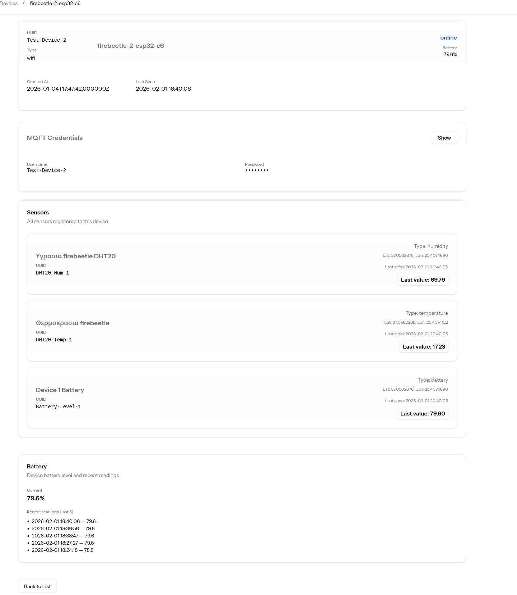

# Αναφορά 4

**Repository:** https://github.com/gkalogeitonas/Agronos-iot-device

**Φοιτητής:** Καλογείτονας Γεωργιος

**Επιβλέπων Καθηγητής:** Νικόλαος Σκλάβος

**Ημερομηνία:** Ιανουάριος 2026

---

## Επέκταση Πλατφόρμας (Backend & Frontend)

Πραγματοποιήθηκαν ενημερώσεις στην εφαρμογή Agronos (Laravel) για την υποστήριξη και διαχείριση της παρακολούθησης μπαταρίας.

### Ευφυής Ένδειξη και Διεπαφή Μπαταρίας
Προστέθηκε μια ενοποιημένη υποστήριξη για την ένδειξη μπαταρίας στη σελίδα λεπτομερειών της συσκευής:
- Η διεπαφή εμφανίζει το τρέχον ποσοστό μπαταρίας και παρέχει ένα  ιστορικό μετρήσεων (time-series) για αναφορά.
- Τα ιστορικά δεδομένα φορτώνονται καθυστερημένα (lazy loading) ώστε να μην επηρεάζουν την αρχική ταχύτητα φόρτωσης της σελίδας.
- Η τελευταία διαθέσιμη τιμή μπαταρίας ανακτάται από την τοπική βάση δεδομένων της εφαρμογής και εμφανίζεται στην διεπαφή.

Η ενοποίηση αυτή διατηρεί την παρουσίαση της μπαταρίας απλή για τον χρήστη, ενώ τα τεχνικά δεδομένα και τα ιστορικά παραμένουν διαθέσιμα στις διαγνωστικές οθόνες των συσκευών.

Σημείωση. Όταν φτιάξαμε τον πίνακα των συσκευών, είχαμε προβλέψει κι ένα πεδίο ώστε να κρατάμε εκεί το επίπεδο της μπαταρίας, θεωρώντας ότι θα το στέλναμε ως metadata μαζί με τις μετρήσεις της συσκευής. Τελικά, προτιμήθηκε, αντί για metadata, να δημιουργήσουμε έναν αισθητήρα μπαταρίας, ώστε να εκμεταλλευτούμε την ήδη υπάρχουσα υποδομή για τους αισθητήρες, τόσο στο επίπεδο της συσκευής όσο και στο επίπεδο της εφαρμογής.
Με αυτόν τον τρόπο μπορούμε να βρούμε το επίπεδο της μπαταρίας της συσκευής απλά κοιτώντας την τιμή του αισθητήρα μπαταρίας της κάθε συσκευής και να μη χρειαζόμαστε το πεδίο στην ίδια τη συσκευή.
Θα μπορούσαμε, κατά την κατανάλωση των μετρήσεων, να ξεχωρίσουμε το επίπεδο της μπαταρίας και να το καταχωρήσουμε απευθείας στον πίνακα της συσκευής, το οποίο θα μας εξοικονομούσε ένα database query κατά την εμφάνισή της. Προς το παρόν, επιλέγουμε να μην το κάνουμε και να αφήσουμε την κατανάλωση των μετρήσεων από τους αισθητήρες ως έχει.
Έτσι, σχεδιάσαμε μια μέθοδο όπου κοιτάμε πρώτα αν υπάρχει τιμή για το επίπεδο της μπαταρίας στα δεδομένα του μοντέλου της συσκευής και, αν δεν βρεθεί, προχωράμε να το ψάξουμε στα δεδομένα των αισθητήρων της.
Κύριο επιχείρημα για αυτή την επιλογή είναι η διατήρηση της απλότητας και της συνέπειας στον κώδικα κατανάλωσης δεδομένων (data ingestion). Προτιμούμε αυτή η διαδικασία να είναι ταχεία και αποδοτική, αναλαμβάνοντας το μικρό κόστος ενός επιπλέον query κατά την εμφάνιση των δεδομένων. Με αυτόν τον τρόπο, η υπηρεσία έχει μία, καθαρή ευθύνη και όλοι οι αισθητήρες αντιμετωπίζονται ομοιόμορφα.
Παρόλα αυτά, η προσέγγιση αυτή θα επανεξεταστεί στο μέλλον.


```php

    private function getBatteryLevel(Device $device, $sensors): ?float
    {

        if ($device->battery_level !== null) {
            return is_numeric($device->battery_level) ? (float) $device->battery_level : null;
        }

        $batterySensor = $sensors->firstWhere('type', SensorType::BATTERY->value);
        if ($batterySensor && $batterySensor->last_reading !== null) {
            return is_numeric($batterySensor->last_reading) ? (float) $batterySensor->last_reading : null;
        }

        return null;
    }
```




###  Φιλτράρισμα Δεδομένων Αγρού (Scoping)
Για να διατηρηθεί η καθαρότητα των δεδομένων που βλέπει ο τελικός χρήστης (αγρότης):
- Υλοποιήθηκε η μέθοδος `SensorType::farmRelevantValues` στο σύστημα Enums.
- Δημιουργήθηκε το Eloquent Scope `scopeFarmRelevant` στο μοντέλο `Sensor`.

Η λειτουργία αυτή φιλτράρει αυτόματα καθαρά τεχνικούς αισθητήρες (όπως η τάση μπαταρίας ) από τις οθόνες επισκόπησης καλλιέργειας (Farm Dashboard). Έτσι, ο χρήστης εστιάζει αποκλειστικά σε γεωπονικά δεδομένα (Θερμοκρασία, Υγρασία εδάφους/αέρα), ενώ οι τεχνικές μετρήσεις παραμένουν προσβάσιμες μόνο στις διαγνωστικές οθόνες των συσκευών.

Σχετικά αρχεία:
- [app/Enums/SensorType.php](https://github.com/gkalogeitonas/agronos/blob/main/app/Enums/SensorType.php)
- [app/Models/Sensor.php](https://github.com/gkalogeitonas/agronos/blob/main/app/Models/Sensor.php)
- [app/Http/Controllers/FarmController.php](https://github.com/gkalogeitonas/agronos/blob/main/app/Http/Controllers/FarmController.php)


### Αλλες αλλαγες στην σελιδα των συσκευων 

Όπως φαίνεται και στην εικόνα που έχει ενσωματωθεί παραπάνω, η σελίδα πληροφοριών της κάθε συσκευής έχει πλέον εμπλουτιστεί με δύο σημαντικά στοιχεία. Πλέον, κάτω από τα βασικά χαρακτηριστικά της, εμφανίζεται η λίστα με όλους τους αισθητήρες που της ανήκουν.

Επιπλέον, προστέθηκε και μια ενότητα όπου προβάλλονται τα διαπιστευτήρια (MQTT credentials) που έχουν εκδοθεί για τη συγκεκριμένη συσκευή, διευκολύνοντας έτσι τη διαχείριση και τον έλεγχο της συνδεσιμότητας της.

### Οπτικοποίηση Μετρήσεων Αισθητήρα

Στη σελίδα του αισθητήρα προστέθηκε ένα διαδραστικό γράφημα (Line Chart) για την απεικόνιση των ιστορικών μετρήσεων. 
- Το γράφημα υλοποιήθηκε με τη βιβλιοθήκη `Vue ApexCharts` και υποστηρίζει δυναμική επιλογή χρονικού εύρους (Time Range), προσφέροντας επιλογές όπως 1 ώρα, 24 ώρες, 7 ημέρες, κλπ.
- Ανάλογα με το επιλεγμένο εύρος, τα δεδομένα ομαδοποιούνται (aggregation) μέσω της InfluxDB (π.χ. μέσος όρος ανά 15 λεπτά για το 24ωρο) ώστε να βελτιστοποιηθεί η απόδοση και να διασφαλιστεί η σωστή απεικόνιση τάσεων.


### Βελτιστοποίηση Απόδοσης (Lazy Loading)

Για να εξασφαλιστεί η ταχύτατη φόρτωση της σελίδας, υιοθετήθηκε η τεχνική `Deferred Props` του Inertia v2. Πλέον, τα "βαριά" δεδομένα δεν φορτώνονται κατά την αρχική απόδοση, αλλά ανακτώνται ασύγχρονα αμέσως μετά την εμφάνιση της σελίδας.

Τα δεδομένα που φορτώνονται με καθυστέρηση (defer) είναι:
1.  Τα δεδομένα του γραφήματος (`chartData`)
2.  Τα στατιστικά στοιχεία (`stats`)
3.  Οι πρόσφατες μετρήσεις (`recentReadings`)

Αυτή η αλλαγή επιτρέπει στον χρήστη να έχει άμεση πρόσβαση στα βασικά στοιχεία του αισθητήρα, ενώ τα ιστορικά δεδομένα εμφανίζονται μόλις είναι διαθέσιμα.

### Ενημερωμένα Αρχεία
### Ενημερωμένα Αρχεία
- [app/Http/Controllers/SensorController.php](https://github.com/gkalogeitonas/agronos/blob/main/app/Http/Controllers/SensorController.php)
- [app/Services/TimeSeries/SensorTimeSeriesService.php](https://github.com/gkalogeitonas/agronos/blob/main/app/Services/TimeSeries/SensorTimeSeriesService.php)
- [app/Enums/TimeRange.php](https://github.com/gkalogeitonas/agronos/blob/main/app/Enums/TimeRange.php)
- [resources/js/pages/Sensors/Show.vue](https://github.com/gkalogeitonas/agronos/blob/main/resources/js/pages/Sensors/Show.vue)
(Το στιγμιότυπο οθόνης του αισθητήρα έχει προστεθεί ως placeholder παραπάνω — αντικαταστήστε PLACEHOLDER_IMAGE με το αρχείο εικόνας σας.)


